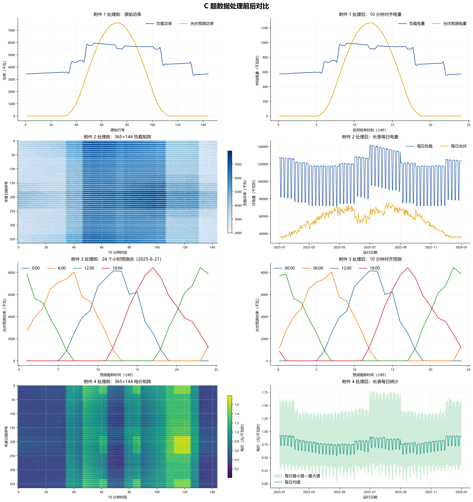
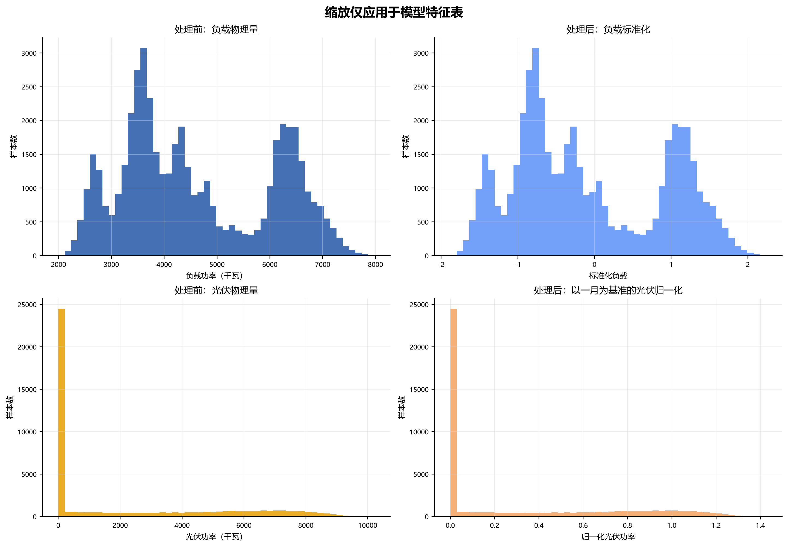

<a id="top"></a>

<div align="center">
  <h1>光伏、储能与购电计划优化</h1>
  <p>园区能源调度 · 日前计划 · 日内滚动优化 · 波动电价分析</p>
  <p><strong>Python 3.12+</strong> &nbsp; · &nbsp; SciPy / HiGHS &nbsp; · &nbsp; 10 分钟调度</p>
  <p>
    <a href="#results">主要结果</a> &nbsp; / &nbsp;
    <a href="#run">快速开始</a> &nbsp; / &nbsp;
    <a href="#project">目录与开发</a> &nbsp; / &nbsp;
    <a href="#model">数学模型</a>
  </p>
</div>

---

本项目研究园区如何联合安排光伏、储能和外网购电，在满足负载需求的同时降低购电费用。本文是项目的统一入口：集中说明问题拆解、数据预处理、数学模型、运行命令、结果解读和检验依据。

<a id="results"></a>

## 主要结果速览

问题一评价一个典型日；问题二至四评价 2025 年 2 月 1 日至 12 月 31 日，共 334 天。表中费用为各自评价期的总购电费用，日内方案包含调整费用。

| 问题与方案 | 总费用（元） | 主要结论 | 详细求解与结果 |
| --- | ---: | --- | --- |
| 问题一：典型日计划 | 35,126.95 | 相比无储能基线，费用降低 26.90% | [求解过程](#q1) · [结果包](result/result1/README.md) |
| 问题二：固定电价日前计划 | 16,699,663.60 | 紧急购电费用为 993,419.64 元，作为日内调整的比较基准 | [求解过程](#q2) · [结果包](result/result2/README.md) |
| 问题三：固定电价日内调整 | 16,382,836.18 | 相比问题二降低 1.90%，全年调整 665 次 | [求解过程](#q3) · [结果包](result/result3/README.md) |
| 问题四：波动电价日前计划 | 17,224,180.08 | 按波动电价重新优化，紧急购电费用为 1,055,616.85 元 | [求解过程](#q4) · [结果包](result/result4-2/README.md) |
| 问题四：波动电价日内调整 | 16,969,696.31 | 相比同电价日前方案降低 1.48%，全年调整 675 次 | [求解过程](#q4) · [结果包](result/result4-3/README.md) |

这些结果来自历史数据回放。问题一的单日费用不与年度费用直接比较；问题三与问题二的信息条件不同，在相同零点信息的对照下，日内更新在固定电价和波动电价下分别节省 0.75% 和 0.79%。各问题章节给出模型、运行命令、程序输出和结果解读。

<details>
<summary><strong>完整阅读导航 · 展开查看十个章节</strong></summary>

1. [总体思路](#overview)
2. [问题拆解与数据预处理](#data)
3. [符号、参数与统一约束](#model)
4. [环境准备与运行入口](#run)
5. [问题一：典型日计划](#q1)
6. [问题二：年度日前计划](#q2)
7. [问题三：日内滚动调整](#q3)
8. [问题四：波动电价](#q4)
9. [结果依据、检验与适用范围](#validation)
10. [项目目录与开发说明](#project)

</details>

<a id="overview"></a>

## 一、总体思路

题目数据分为典型日负载与电价、全年负载与光伏实际出力、分时发布的光伏预测、全年波动电价。程序先把它们对齐到 10 分钟时段，再按决策时刻可获得的信息构造预测与历史场景，求解购电和储能动作，最后核对能量平衡、储电量连续性和费用。


四问依次扩展：问题一研究已知条件下的典型日最优计划；问题二处理年度预测误差；问题三利用日内新信息修正计划；问题四检验波动电价下的策略表现。


四问共用能量守恒和储能约束：

```text
计划购电 + 紧急购电 + 放电 - 充电 - 弃光 = 负载 - 光伏
本时段储电量 = 上时段储电量 + 充电效率 × 充电量 - 放电量 ÷ 放电效率
```

储电量限制为 1,200～10,800 千瓦时，初值为 6,000 千瓦时，充放电功率上限为 5,000 千瓦。问题一日末回到初值；问题二至四保持跨日连续，不能每天重置。1 月用于预测校准与储能初始化，年度费用评价区间为 2025 年 2 月 1 日至 12 月 31 日，共 334 天。

### 模型处理流程

下图串联数据检查、输入构造、模型求解与结果检验，可结合后文的统一约束和各问题模型阅读。点击图片可打开详细的交互式求解流程图。

[](assets/diagrams/sxjm-solver-workflow.html)

[打开交互式求解流程](assets/diagrams/sxjm-solver-workflow.html)，查看日前决策、日内更新与实际执行之间的衔接。

### 代码与模型的对应关系

项目架构图展示统一入口、数据预处理、场景构造、优化内核、求解编排和结果核验之间的关系。阅读代码时，可先从根目录 `main.py` 进入，再按图定位 `src` 中的具体实现；模块说明见[项目目录与开发说明](#project)。

[](assets/diagrams/sxjm-project-architecture.html)

[打开交互式项目架构图](assets/diagrams/sxjm-project-architecture.html)。两幅交互图及其定义文件统一保存在 `assets/diagrams`。

<a id="data"></a>

## 二、问题拆解与数据预处理

### 问题目标与交付要求

| 问题 | 直接目标 | 隐含铺垫目标（结构推断） | 核心成果 | 不能混淆的目标 |
| --- | --- | --- | --- | --- |
| 问题1 | 根据给定日内电价、负载和光伏预测，在0:00制定保供且购电费用尽可能小的单日策略，满足储能边界及日首尾电量相等 | 建立共用的功率—电量换算、储能状态方程、供需平衡、购电成本和结果汇总模块；形成确定性调度基准 | 数学模型＋单日联合调度方案＋表1/表2＋result1.xlsx | 用给定预测求解，不是要求另建光伏预测模型；该日费用也不是与其他月份直接比较优劣的统一基准 |
| 问题2 | 在负载、光伏变化时逐日制定计划，实际不足由5倍单价紧急购电补齐，并按计划量及紧急量结算 | 将问题1的给定输入扩展为受信息约束的预测或情景输入；建立计划与实际执行分离的回测机制，暴露缺口及过量计划的代价 | 逐日策略＋实际紧急购电结果＋指定日期表格＋result2.xlsx | 目标是购电成本与保供，不是单独追求预测误差最小或紧急购电量绝对为零 |
| 问题3 | 利用0:00预报制定计划，利用6:00、12:00、18:00预报制定调整策略，计入调整费用，并分析额外预报是否值得引入 | 建立“获取新信息—更新决策—执行—核算”的反馈过程，识别新信息的经济价值和调整代价，为波动价格下的滚动调度提供基础 | 日前与日内联合模型＋最终执行方案＋预报价值结论＋result3.xlsx | 预报更准确不等于调度一定更省钱；“允许调整”不等于每次都必须改变量 |
| 问题4 | 在附件4的波动电价下分别重新计算问题2和问题3，提交两套策略及费用 | 检验方法在价格变化条件下的适用性，并分析价格变化与日内调整机制的关系 | 波动价格模型＋4-2与4-3两套方案＋对应结果文件 | 必须重新优化购电与储能动作；对旧方案换价格计费只能作为附加对照，不能替代本问求解 |

所有问题的“费用尽可能小”均以满足题面和明确假设下的可行性为前提。问题2—4在决策时面对未知量，需优化预测成本、情景期望成本或明确的风险目标；事后再用真实记录核算实际费用。不能把全年未来实际量直接放进日前优化后称为可在线实施的策略。

### 数据来源与处理原则

题目自带完整数据，数据源为[原始题目](题目.docx)、附件 1 至附件 4 四个原始 Excel 工作簿及附录中的储能参数。因此无需联网检索或引入外部公开数据。

原始数值数据完整，日期和时段覆盖齐全，无重复主键、空数值、无穷值或负值。光伏功率中的零值集中在夜间，具有明确物理意义，不能当作缺失值填补；极低电价和较高光伏峰值也仍为非负有效观测，未作截尾或删除。

数据需要结构性预处理，原因是原表不适合直接按统一时间索引建模：附件 1 的时间列混合 Excel 时间值与文本；附件 2 和附件 4 为日期乘 144 个时段的宽表；附件 3 每日只有第一条记录填写日期，且 24 个小时预测横向展开。预处理只统一类型、补全结构性日期、宽转长、建立时间戳、合并同粒度数据，并生成显式的功率转电量字段。原始输入文件未被覆盖。

### 原始数据范围

| 数据文件 | 工作表及有效维度 | 时间范围与粒度 | 主要用途 |
| --- | --- | --- | --- |
| 附件 1 | `Sheet1`，144 行记录 × 4 列 | 代表日，00:10 至次日 00:00，共 144 个 10 分钟区间 | 问题 1 的固定电价、负载和光伏预测 |
| 附件 2 | `小区负载`，365 × 144；`光伏发电实际功率`，365 × 144 | 2025-01-01 至 2025-12-31；每日 144 个 10 分钟区间 | 问题 2 至问题 4 的负载和光伏实际功率 |
| 附件 3 | `Sheet1`，1460 行发布记录 × 26 列 | 2025 年每日 0:00、6:00、12:00、18:00 发布；每次含未来 1 至 24 小时预测 | 问题 3、问题 4 的滚动光伏预测 |
| 附件 4 | `Sheet1`，365 × 144 | 2025-01-01 至 2025-12-31；每日 144 个 10 分钟区间 | 问题 4 的波动电价 |
| 附录 1 | 6 项储能参数 | 设备与优化约束 | 容量、功率、初值、运行边界和效率 |

Excel 维度不含标题行时如上；对应工作簿的实际占用维度分别为 145×4、366×145、1461×26 和 366×145。`data/templates` 与 `data/interim/templates` 中的文件是结果模板或既有结果，不属于原始输入，不参与数据质量判定和预处理。

### 字段、单位和数据类型

#### 附件 1

| 原字段 | 含义 | 单位 | 原始类型 | 预处理类型 |
| --- | --- | --- | --- | --- |
| 时间 | 10 分钟区间结束时刻；`0:00+1` 表示当日 24:00 | 时刻 | Excel 时间与文本混合 | 整数分钟及标准时间标签 |
| 电价 | 外网购电单价 | 元/kWh | 数值 | 浮点数 |
| 小区负载 | 负载功率 | kW | 数值 | 浮点数 |
| 光伏发电预测功率 | 光伏预测功率 | kW | 数值 | 浮点数 |

预处理同时生成 `load_energy_kwh` 和 `pv_forecast_energy_kwh`，用于与购电量、充放电量的 kWh 口径直接匹配。

#### 附件 2 与附件 4

| 原字段或维度 | 含义 | 单位 | 原始类型 | 预处理类型 |
| --- | --- | --- | --- | --- |
| 日期 | 每行对应的运行日 | 日期 | Excel 日期 | ISO 日期 |
| 00:10 至 0:00+1 | 144 个 10 分钟区间的结束时刻 | 时刻 | Excel 时间；末列为文本 | 完整区间开始和结束时间戳 |
| 小区负载 | 附件 2 工作表一中的负载功率 | kW | 数值 | 浮点数 |
| 光伏发电实际功率 | 附件 2 工作表二中的光伏实际功率 | kW | 整数与浮点数混合 | 浮点数 |
| 电价 | 附件 4 中的实时电价 | 元/kWh | 整数与浮点数混合 | 浮点数 |

三组数据拥有完全相同的 365 个日期和 144 个时段，预处理后按 `operating_date + interval_index` 一一合并。

#### 附件 3

| 原字段 | 含义 | 单位 | 原始类型 | 预处理类型 |
| --- | --- | --- | --- | --- |
| 日期 | 预测发布日期；每日仅首行填写 | 日期 | 文本加结构性空白 | 日期向下补全后转 ISO 日期 |
| 预报时刻 | 每日四个预测发布时刻 | 时刻 | 文本 | 发布时间戳 |
| 预报1小时至预报24小时 | 相对发布时间的未来整点光伏预测 | kW | 数值 | `horizon_hour` 整数加 `pv_forecast_kw` 浮点数 |

日期列的 1095 个空白恰好对应每个日期后续 6:00、12:00、18:00 三行，是版式性省略，不是数据丢失。向下补全后形成 365 天 × 4 个发布时刻 = 1460 条预测记录，每条有 24 个预测值。

### 数据质量检查结果

| 数据块 | 数值范围 | 缺失 | 重复主键 | 负值或无穷值 | 判定 |
| --- | --- | ---: | ---: | ---: | --- |
| 附件 1 电价 | 0.3713 至 1.3952 元/kWh | 0 | 0 | 0 | 有效 |
| 附件 1 负载 | 3309.3934 至 5958.9696 kW | 0 | 0 | 0 | 有效 |
| 附件 1 光伏预测 | 0 至 7612.316 kW | 0 | 0 | 0 | 有效 |
| 附件 2 负载 | 1995.7176 至 7978.8849 kW | 0 | 0 | 0 | 有效 |
| 附件 2 光伏实际 | 0 至 10216.2 kW | 0 | 0 | 0 | 有效，夜间零值保留 |
| 附件 3 光伏预测 | 0 至 9995.8875 kW | 0 | 0 | 0 | 有效，夜间零值保留 |
| 附件 4 电价 | 0.0076 至 1.7936 元/kWh | 0 | 0 | 0 | 有效 |

附件 2 和附件 4 均完整覆盖 2025 年 365 个自然日，没有日期断档。附件 3 每日四个发布时刻齐全，日期与发布时刻组合不重复。附件 1 的分时负载和电价与年度同一时段均值仅存在原表四位小数舍入量级差异；其近零光伏预测在少数晨昏时段被置零，不应反向用年度均值替换。

### 已执行的预处理

1. 将所有 10 分钟时段统一为 1 至 144 的 `interval_index`，并生成区间开始、区间结束、分钟偏移和持续时间；`0:00+1` 统一表示 24:00。
2. 将附件 2 和附件 4 从宽表转换为长表，按运行日和时段索引一一合并。
3. 将附件 3 的日期按每日四行版式向下补全，转换为每条预测对应一个目标时间戳的小时长表。
4. 按 `E=P×Δt` 且 `Δt=10/60 小时` 生成负载和光伏电量，原始功率字段仍保留。
5. 以发布时刻的实际光伏功率作为 0 小时锚点，在 0 至 24 小时预测点之间线性插值，生成与调度网格一致的 10 分钟预测版本；未插值的小时版本同时保留，便于替换插值方法或做敏感性分析。
6. 逐表复核行数、主键唯一性、缺失、非有限数和负值；全部通过。

预处理没有执行异常值删除、均值填补、缩尾、归一化或标准化。正式求解使用原始物理单位。可选特征流程另行生成缩放特征，不替换求解输入。

<a id="data-comparison"></a>

### 全部数据的处理前后对照

下图汇总各数据表处理前后的对照，用于结合前述字段和处理步骤检查数据变化。正式求解保留功率、电量和电价的物理单位；可选的特征缩放仅用于数据分析，不替换模型输入。



### 时间与换算假设

| 假设 | 采用方式 | 依据与影响 |
| --- | --- | --- |
| 10 分钟字段的时点含义 | 00:10 对应 00:00 至 00:10 区间，24:00 对应 23:50 至 24:00 区间 | 题面把 `0:00+1` 定义为当天 24:00，且结果模板要求间隔 10 分钟的购电量 |
| 功率转电量 | 每个区间按常值功率处理，`kWh=kW×1/6` | 原始数据单位为 kW，决策及结果单位为 kWh；这是离散调度的标准矩形积分 |
| 小时预测转 10 分钟 | 发布时刻实际值作为 0 小时点，其后相邻小时预测点线性插值 | 保证时序连续且不引入外部数据；小时原表同时保留，可在建模阶段改为阶梯保持并比较敏感性 |
| 2025-01-01 00:00 锚点 | 取 0 kW | 原始实际表没有上一日 24:00；该时刻为夜间，且对应预测的随后小时值为 0。全数据仅这一处使用该边界假设 |

### 预处理输出

| 输出文件 | 行数 × 列数 | 内容 |
| --- | ---: | --- |
| `typical_day_10min.csv` | 144 × 11 | 问题 1 的代表日 10 分钟数据及功率转电量字段 |
| `year_actuals_tariff_10min.csv` | 52560 × 10 | 2025 年负载、光伏实际功率和波动电价的统一长表 |
| `pv_forecasts_hourly_long.csv` | 35040 × 6 | 附件 3 的原始小时预测长表 |
| `pv_forecasts_10min_linear.csv` | 210240 × 7 | 四个每日发布时刻各自对应的未来 24 小时 10 分钟预测 |
| `model_parameters.json` | 参数文件 | 题面参数、派生参数和未写入原始数据的场景假设 |
| `data_quality_report.json` | 质量报告 | 源文件哈希、处理步骤、范围、完整性和唯一性检查结果 |

全部输出位于 `data/processed`。可复现脚本为 `src/preprocessing.py`。

### 输出时间口径

- 表1六个区间：10:00—10:10、12:00—12:10、14:00—14:10、16:00—16:10、18:00—18:10、20:00—20:10；同时给出全天购电量和购电费。
- 表2六个汇总段：0:00—4:00、4:00—8:00、8:00—12:00、12:00—16:00、16:00—20:00、20:00—24:00；充电量与放电量分别累计，另记日初与日末储电量。
- 问题2、3指定日期：2025-03-20、2025-06-21、2025-09-23、2025-12-21。问题4的“重算问题2和3”沿用相应结果口径；可增加全期统计。
- 问题2—4完整期间为334日，每日144段，合计48096段；单日不能只提交六个指定段的结果。
- 表4是紧急购电填写示例，不是要求求解复现的数值目标。

### 工作簿内容

| 结果文件 | 必须包含的工作表 | 记录值的含义 | 必须保留的区分 |
| --- | --- | --- | --- |
| result1.xlsx | 计划购电量、充放电量 | 给定日的计划购电；指定段充放电与日边界状态 | 区间电量与时刻储电量 |
| result2.xlsx | 计划购电量、充放电量、紧急购电量 | 每日0:00计划；按既定执行规则产生的充放电和状态；实际紧急购电事件 | 计划计费量与实际补购；日初状态与前日状态 |
| result3.xlsx | 计划购电量、调整购电量、充放电量、紧急购电量 | 原始0:00计划；按约定口径记录调整；最终充放电和紧急购电 | 原始计划、调整后总量与调整增量；各次内部版本与最终结果 |
| result4-2.xlsx | 计划购电量、充放电量、紧急购电量 | 波动电价下重算问题2后的结果 | 原问题2策略与重新优化策略 |
| result4-3.xlsx | 计划购电量、调整购电量、充放电量、紧急购电量 | 波动电价下重算问题3后的结果 | 原始、调整、实际执行与完整账单 |

<a id="model"></a>

## 三、符号、参数与统一约束

### 符号说明

以运行日为外层索引，每日有 144 个时段。下表省略日期下标；场景变量带上标 $`\omega`$，同一次求解中共用的储能动作不带场景上标。

| 符号 | 简要说明 | 单位 |
|---|---|---|
| $`t\in T`$ | 调度时段编号，$`T=\{1,\ldots,144\}`$ | — |
| $`\omega\in\Omega`$ | 不确定情景编号及情景集合 | — |
| $`\Delta t`$ | 单个调度时段长度，$`\Delta t=1/6`$ | h |
| $`P_t^{\mathrm L},P_t^{\mathrm{PV}}`$ | 小区负荷功率、光伏发电功率 | kW |
| $`N_t`$ | 净负荷电量，$`N_t=(P_t^{\mathrm L}-P_t^{\mathrm{PV}})\Delta t`$ | kWh |
| $`p_t`$ | 外网购电价格 | 元/kWh |
| $`q_t^0,q_t`$ | 原始计划购电量、更新后计划购电量 | kWh |
| $`x_t,h_t`$ | 实际使用的计划电量、紧急购电量 | kWh |
| $`c_t,d_t`$ | 储能充电量、放电量（母线侧） | kWh |
| $`s_t`$ | 弃光或未利用电量 | kWh |
| $`E_t,E^{\min},E^{\max}`$ | 储能电量及其下限、上限 | kWh |
| $`P^{\max}`$ | 储能最大充、放电功率 | kW |
| $`\eta_{\mathrm c},\eta_{\mathrm d}`$ | 充电效率、放电效率 | — |
| $`y_t`$ | 充放电状态变量，$`y_t=1`$表示充电 | — |
| $`u_t,v_t`$ | 相对原计划的调增量、调减量 | kWh |
| $`C_\omega`$ | 情景$`\omega`$下的购电总费用 | 元 |
| $`\pi_\omega`$ | 情景$`\omega`$的经验概率 | — |
| $`D_{j\omega},\gamma_{j\omega}`$ | 轨迹距离、情景间转移的概率质量 | — |
| $`\varepsilon`$ | Wasserstein分布鲁棒半径 | — |
| $`\alpha,\lambda`$ | CVaR置信水平、目标函数风险权重 | — |
| $`\zeta,\xi_\omega`$ | CVaR风险阈值、超额费用变量 | 元 |

注：“—”表示无量纲；$`(z)^+=\max\{z,0\}`$。为避免符号混淆，本文统一以$`\omega`$表示情景、以$`s_t`$表示弃光量。

### 正式计算参数

| 参数 | 取值 | 含义与来源 |
|---|---:|---|
| $`\Delta t`$ | $`1/6`$ 小时 | 10 分钟调度步长 |
| $`E^{\min},E^{\max}`$ | 1,200、10,800 千瓦时 | 储能运行边界 |
| $`E_0`$ | 6,000 千瓦时 | 初始储电量 |
| $`P^{\max}`$ | 5,000 千瓦 | 单方向功率上限 |
| $`\eta_c,\eta_d`$ | 0.90、0.90 | 单向效率假设，往返效率为 0.81 |
| $`S`$ | 8 | 缩减后的代表场景数 |
| $`\alpha`$ | 0.80 | 条件风险价值置信水平 |
| $`\alpha_c`$ | 0.90 | 预测区间名义覆盖率，与 $`\alpha`$ 区分 |
| $`\lambda`$ | 0.20 | 条件风险价值权重 |
| $`\varepsilon`$ | 0.15 | 有限支撑运输距离半径 |
| $`\rho`$ | 0 | 调减购电时不返还原计划电费 |
| $`\kappa`$ | $`10^{-6}`$ 元/千瓦时 | 吞吐惩罚，用于区分同费用解，不计入实际电费 |

参数来自 [模型配置](src/model_config.py) 和 [正式运行摘要](result/result2/运行结果.json)。风险参数属于建模设定，不能称为已经过独立样本调优的最优参数。

### 功率换算与能量平衡

```math
L_t=P_t^{\mathrm L}\Delta t,\qquad
G_t=P_t^{\mathrm{PV}}\Delta t,\qquad N_t=L_t-G_t.
```

因此单时段最大充、放电量为 $`\bar B=P^{\max}\Delta t=833.3333`$ 千瓦时。每个时段、每个场景满足

```math
x_t^\omega+h_t^\omega+d_t=N_t^\omega+c_t+s_t^\omega,
\qquad 0\le x_t^\omega\le q_t.
```

计划量 $`q_t`$ 决定应付费用，实际取用量 $`x_t^\omega`$ 可以少于计划量，已付费但未使用的计划电不必强行注入系统。模型不设置售电收入或负购电量；无法消纳的光伏允许弃置。问题一取 $`x_t=q_t`$ 且 $`h_t=0`$。

### 储能状态与互斥

```math
E_t=E_{t-1}+\eta_c c_t-\frac{d_t}{\eta_d},\qquad
E^{\min}\le E_t\le E^{\max},
```

```math
0\le c_t\le\bar B y_t,\qquad
0\le d_t\le\bar B(1-y_t),\qquad y_t\in\{0,1\}.
```

先求线性松弛并检查充放电互补条件；若同一时段出现超容差的同时充放电，则启用二元模式重新求解。不能仅因目标中含吞吐惩罚就假定互斥必然成立。

问题一约束 $`E_{144}=E_0`$。问题二至四的实际状态满足 $`E_{i+1,0}=E_{i,144}`$；每次计划使用 6,000 千瓦时作为终端参考，实际执行结束后不强制重置，而是向下一日传递真实末态。

### 信息与结算边界

- 历史真实值只在对应时刻到达后用于执行和后续预测，不能用于提前制定计划。
- 负载不可削减；原题未给并网容量上限，模型假设普通或紧急购电可以补足缺口。
- 紧急购电价格为基础电价的 5 倍；调整费用按最终接受计划相对原始计划的净变化核算。
- 问题四主结果假设当日电价曲线在零点已知，未知电价另行计算。
- 未引入题面未给定的售电收入、碳价、电池老化成本和网络潮流参数；改变这些条件需要扩展模型。

<a id="run"></a>

## 四、环境准备与运行入口

### 开发环境简介

| 项目 | 环境与用途 |
| --- | --- |
| Python | `pyproject.toml` 要求 **3.12 或更高版本**；本地 `.venv` 使用 CPython 3.12 |
| 本地开发平台 | Windows + PowerShell；下文命令均在项目根目录执行 |
| 环境管理 | uv 创建 `.venv`，按 `uv.lock` 同步依赖；项目设置 `package = false`，无需安装项目包 |
| 数值计算与求解 | NumPy 处理数组，SciPy 构造稀疏约束并调用 HiGHS 求解器 |
| 数据与工作簿 | pandas 处理时序表，openpyxl 读写 Excel，无需启动 Microsoft Excel |
| 图表 | Matplotlib 输出调度、费用和数据诊断图 |
| 类型与格式 | pandas-stubs、scipy-stubs 提供类型提示；Ruff 配置为 Python 3.12、100 字符行宽，Ruff 本身未列入项目依赖 |
| 回归测试 | Python 标准库 unittest，通过 `main.py test` 发现 `src/test_*.py` |

依赖版本要求以 [pyproject.toml](pyproject.toml) 为准，完整解析版本见 [uv.lock](uv.lock)。先准备 Python 与 uv，并用以下命令确认工具可用：

```powershell
python --version
uv --version
```

### 安装与首次运行

在项目根目录执行；`--locked` 要求沿用现有锁文件，配置与锁文件不一致时会报错，便于发现环境偏差：

```powershell
uv sync --locked
uv run python main.py preprocess
uv run python main.py solve --ablations
uv run python main.py test
```

所有操作均通过根目录 `main.py` 分派。`solve` 运行全部问题，`--ablations` 额外计算相同零点信息下不进行日内更新的对照组。最终文件按问题保存到 `result/result1/`、`result/result2/`、`result/result3/`、`result/result4-2/` 和 `result/result4-3/`。每份包含工作簿、图片、运行摘要、程序输出与独立 README；中间计算使用系统临时目录，完成后自动清理。

分问命令只更新对应的最终结果包。完整年度总运行同时更新 `assets/results/` 中的展示图，结果包中的图片为独立副本。问题二至四的一日检查必须显式指定独立交付目录，例如：

```powershell
uv run python main.py q2 --days 1 --output result/check
```

`result/check/` 仅供开发验证，不能与完整年度费用直接比较。

<a id="q1"></a>

## 五、问题一：典型日购电与储能计划

[返回主要结果速览](#results)

**核心实现。** [dispatch.py](src/dispatch.py) 的 `solve_question1` 组装典型日输入；[optimization.py](src/optimization.py) 的 `solve_energy_plan` 建立稀疏约束并调用线性规划求解器。

```powershell
uv run python main.py q1
```

正式结果：[result1.xlsx](result/result1/result1.xlsx)。

### 模型构建

#### 模型原理

问题1中，电价、负荷与光伏预测均已在0:00给定，核心任务是在满足分时供需平衡和储能约束的条件下确定购电与充放电方案。该问题可表示为时空能量网络：每个时段对应一个能量节点，外网购电与光伏发电构成供给，负荷构成需求，储能通过状态变量 $`E_t`$ 将相邻时段连接起来，充放电效率则体现跨时段能量损耗。基于此，本文建立时空能量网络线性规划模型。

在该模型中，分时供需平衡对应节点守恒，储能容量和功率限制对应弧容量，首末储电量一致对应周期边界。相邻时段仅通过 $`E_{t-1}`$ 与 $`E_t`$ 耦合，因此约束矩阵呈带状稀疏结构，可采用线性规划高效求解。

#### 核心公式与推导逻辑

**目标函数**为全天购电费用最小，并加入极小的吞吐惩罚以避免费用相同的多重最优解：

```math
\min\ C_1=\sum_{t=1}^{144}p_tq_t+\kappa\sum_{t=1}^{144}(c_t+d_t).
```

其中 $`p_t`$ 为时段 $`t`$ 的电价，$`q_t`$ 为普通购电量；$`\kappa=10^{-6}`$ 元/kWh仅用于打破多重最优，不计入最终报告的实际电费。符号 $`\kappa`$ 与后文Wasserstein半径 $`\varepsilon`$ 相互区分。

**节点能量平衡约束**要求每个时段供给与需求（含储能搬运量）严格匹配：

```math
q_t+G_t+d_t=L_t+c_t+s_t,\qquad t=1,\ldots,144,
```

其中 $`L_t=\bar P_t^{\mathrm{load}}\Delta t`$ 为负荷电量，$`G_t=\bar P_t^{\mathrm{PV}}\Delta t`$ 为光伏发电电量。该约束在每个时段独立成立，对应网络流中的节点守恒关系。

**储能动态方程**采用母线侧充放电量口径，充电时内部电量增加须乘以充电效率，放电时内部电量减少须除以放电效率：

```math
E_t=E_{t-1}+\eta_c c_t-\frac{d_t}{\eta_d},\qquad t=1,\ldots,144.
```

其中 $`E_0=6000`$ kWh 为题设初始储电量，$`\eta_c=\eta_d=0.9`$ 对应充、放电单向效率均为90%；若题设中的90%指往返效率，则应改取 $`\eta_c=\eta_d=\sqrt{0.9}`$，本文将后一口径用于敏感性复算。

**储电量安全区间约束**确保设备在物理可运行范围内工作：

```math
1200\le E_t\le 10800,\qquad t=1,\ldots,144.
```

**充放电量上限**由额定功率转换得到：

```math
0\le c_t\le \bar B,\qquad 0\le d_t\le \bar B,
\qquad \bar B=5000\Delta t\approx833.333\ \mathrm{kWh}.
```

本题连续模型的最优解未出现同时充放电。若其他参数情形出现该现象，可增加 $`0\le c_t\le\bar B y_t`$、$`0\le d_t\le\bar B(1-y_t)`$、$`y_t\in\{0,1\}`$，将模型扩展为混合整数线性规划。

**首尾电量闭环约束**实现问题1特有的日周期要求：

```math
E_{144}=E_0=6000\text{ kWh}.
```

**弃光非负约束**：

```math
0\le s_t\le \max\{G_t-L_t,0\},
\qquad t=1,\ldots,144.
```

上述模型为带状稀疏线性规划：相邻时段仅通过 $`E_{t-1}`$ 与 $`E_t`$ 耦合，可由线性规划求解器获得全局最优解；若加入二元互斥变量，则相应模型为混合整数线性规划。

### 模型求解

采用HiGHS线性规划求解器计算144时段调度方案，并对供需平衡、储能状态及费用结果进行独立复核。

典型日求解结果如下：全天购电量 59,482.70 kWh、总充电量 20,740.67 kWh、总放电量 16,799.94 kWh、充放电损耗 3,940.73 kWh、弃光量 0.00 kWh；全天购电成本 35,126.95 元，无储能基线为 48,052.05 元，下降 26.90%。购电量的能量关系可由"减少的弃光 6,247.96 kWh − 储能损耗 3,940.73 kWh = 减少的外购电量 2,307.24 kWh"直接验证；末端储电量 6,000.000 kWh，与首端严格相等。

典型日调度曲线显示：无储能基线在中午存在光伏余电，而在傍晚负荷高峰仍需大量外购；优化后，储能在光伏富余或电价较低的时段充电，并在负荷及电价较高的时段放电，从而实现光伏消纳与能量跨时段转移。


*图1：典型日优化后购电成本由 48,052.05 元降至 35,126.95 元，下降 26.90%；期末储电量回到 6,000 kWh。*

### 结果分析

#### 费用与电量变化

储能并不创造电量，而是付出转换损耗（往返效率 $`0.9^2=0.81`$），将部分光伏富余和低价时段购电转移到高价时段使用。本典型日中，储能消纳的全部 6,247.96 kWh 富余光伏，扣除 3,940.73 kWh 损耗后净减少外购 2,307.24 kWh，对应外购电量减少约 3.73%。但全天购电费用却下降 26.90%，表明**降本主要来自购电时段结构的改变而非绝对电量的减少**——即储能通过"低价时段多买、高价时段少买"重塑了购电对应电价的加权结构。

#### 机制解释与比较边界

从调度曲线看，充电主要集中于11:00—14:00的光伏高出力时段，放电主要集中于18:00—22:00的负荷与电价高峰，表明模型同时利用了光伏余电和峰谷价差。只有当未来放电所替代的购电成本足以覆盖效率损失时，跨时段充放电才具有经济性。

### 数值检验

问题一能量平衡最大残差为 1.14e-13 千瓦时，同时充放电量为 0 千瓦时。日首末状态与容量、功率边界由 `solve_question1` 回归测试核对。效率解释变化时需要重新计算，不把未列入当前检验记录的敏感性结论当作已验证结果。

<a id="q2"></a>

## 六、问题二：年度日前计划

[返回主要结果速览](#results)

**核心实现。** [causal_scenarios.py](src/causal_scenarios.py) 的 `CausalScenarioFactory` 负责预测、区间校准与场景缩减；[stochastic.py](src/stochastic.py) 的 `solve_stochastic_plan` 求解计划，`execute_controls` 按已观察状态执行。

```powershell
uv run python main.py q2
```

正式结果：[result2.xlsx](result/result2/result2.xlsx)。

### 模型构建

#### 模型原理

问题2的关键在于：每日0:00尚不能获知当天真实负荷与光伏出力，计划购电不足会产生5倍电价的紧急购电，而计划购电过多仍需承担相应费用。因此，本文将其建模为两阶段不确定决策，并构建**因果组合预测—有限支持分布鲁棒调度模型**：第一阶段依据历史信息确定计划购电和储能基准动作，第二阶段在实际净负荷到达后以紧急购电补足缺口。

本文直接预测净负荷 $`N_t=L_t-G_t`$，以保留负荷与光伏的抵消关系。预测中心由“近期同一时段中位数”和“历史同星期中位数”加权得到，权重根据此前预测误差动态更新；随后使用彼此分离的历史拟合样本与校准样本构造保形预测区间，并由历史整日残差生成净负荷轨迹，经场景缩减后形成有限支持集。

在每次日前求解中，计划购电量及储能充放电量对所有场景保持一致，紧急购电量随场景变化。因此，该模型属于共同储能动作下的有限场景近似，而非具有任意场景自适应储能策略的完整多阶段模型。目标是在有限支持的Wasserstein模糊集内，最小化最坏分布下的期望购电费用与CVaR风险。

#### 核心公式与推导逻辑

**因果组合点预测**：

设 $`\widetilde N_{t}^{(r)}`$ 为最近7天同一时段净负荷的中位数，$`\widetilde N_{t}^{(w)}`$ 为历史同星期日期对应时段的中位数，则预测中心为

```math
\widehat N_t=w_r\widetilde N_t^{(r)}+w_w\widetilde N_t^{(w)},
\qquad w_r+w_w=1,
```

其中权重按此前滚动窗口内两类预测的平均绝对误差倒数确定：

```math
w_j=\frac{[\max(\mathrm{MAE}_j,1)]^{-1}}
{[\max(\mathrm{MAE}_r,1)]^{-1}+[\max(\mathrm{MAE}_w,1)]^{-1}},
\qquad j\in\{r,w\}.
```

**分割保形校准**：

将最近56天历史残差按时间顺序划分为拟合集 $`\mathcal I_f`$ 和校准集 $`\mathcal I_c`$。令 $`\xi=(1-\alpha_c)/2`$，在拟合集上计算 $`a_t=Q_{\xi}(r_{i,t})`$ 与 $`b_t=Q_{1-\xi}(r_{i,t})`$，并对校准样本定义非一致性分数

```math
s_{i,t}=\max\{a_t-r_{i,t},\ r_{i,t}-b_t\},
\qquad i\in\mathcal I_c.
```

令 $`\gamma_t=\max\{0,Q_{\alpha_c}^{\mathrm{fin}}(s_{i,t})\}`$，其中 $`Q_{\alpha_c}^{\mathrm{fin}}`$ 表示采用秩 $`\lceil(|\mathcal I_c|+1)\alpha_c\rceil`$ 的有限样本经验分位数，则名义覆盖率为 $`\alpha_c`$ 的预测区间为

```math
\left[\widehat N_t+a_t-\gamma_t,\;
\widehat N_t+b_t+\gamma_t\right].
```

该区间只用于预测校准与诊断；优化场景由预测中心叠加历史整日残差构造，不直接取区间上界作为计划购电量。

**两阶段分布鲁棒目标**：

设场景 $`\omega`$ 下的结算费用为

```math
C^\omega=\sum_{t=1}^{T}\left(p_tq_t^0+5p_th_t^\omega\right),
```

则有限支持分布鲁棒模型为

```math
\min_{q^0,c,d,E,\{x^\omega,h^\omega,s^\omega\}_{\omega=1}^{S}}
\ \sup_{\mathbb P\in\mathcal P_\varepsilon}
\left\{\mathbb E_{\mathbb P}[C^\omega]
+\lambda\operatorname{CVaR}_{\alpha,\mathbb P}(C^\omega)\right\}
+\kappa\sum_t(c_t+d_t).
```

其中 $`\mathcal P_\varepsilon`$ 是以缩减后经验分布为中心、定义在同一有限场景支持集上的Wasserstein模糊集：

```math
\mathcal P_\varepsilon=\{\mathbb P:W_1(\mathbb P,\hat{\mathbb P}_N)\le\varepsilon\}.
```

场景间距离采用归一化日内平均绝对距离；在问题4的未知价格情形下，有

```math
D_{ij}=\frac{1}{T\sigma_N}\sum_{t=1}^{T}|N_{i,t}-N_{j,t}|
+\frac{1}{T\sigma_p}\sum_{t=1}^{T}|p_{i,t}-p_{j,t}|,
```

其中 $`\sigma_N`$ 与 $`\sigma_p`$ 分别为场景集中净负荷和价格的尺度参数；固定电价或价格已知时，价格距离项为0。Wasserstein距离由场景概率之间的最小运输成本定义。

CVaR 项通过 Rockafellar–Uryasev 公式线性化：

```math
\operatorname{CVaR}_{\alpha,\mathbb P}(C^\omega)
=\min_{\zeta}\left\{\zeta+\frac{1}{1-\alpha}
\mathbb E_{\mathbb P}\bigl[(C^\omega-\zeta)_+\bigr]\right\}.
```

**逐时段能量平衡与储能动态（场景 $`\omega`$ 下）**：

```math
x_t^\omega+h_t^\omega+d_t
=N_t^\omega+c_t+s_t^\omega,
```

```math
E_t=E_{t-1}+\eta_c c_t-\frac{d_t}{\eta_d},
\qquad 1200\le E_t\le10800.
```

**实际取用计划电约束**：

```math
0\le x_t^\omega\le q_t^0,\qquad
h_t^\omega\ge0,\qquad
0\le s_t^\omega\le\max\{-N_t^\omega,0\}.
```

上式采用净负荷口径，其中 $`s_t^\omega`$ 表示无法消纳的余电。上式将“按计划付费”与“实际取用”严格区分：目标函数按 $`q_t^0`$ 计费，但已付款而未使用的计划电量不强行注入系统。$`c_t,d_t,E_t`$ 在同一次日前求解中对各场景相同，$`x_t^\omega,h_t^\omega,s_t^\omega`$ 为场景相关的平衡变量。为避免日末储能价值缺失，每次规划设置终端参考约束 $`E_T=6000`$ kWh；实际执行不强制回到该值，而是将日末储电量连续传递至下一日。

#### 有限支撑运输约束与代码实现

设 $`\gamma_{j\omega}`$ 把经验场景 $`j`$ 的概率质量运输到场景 $`\omega`$，满足

```math
\sum_\omega\gamma_{j\omega}=\pi_j,\qquad
\sum_{j,\omega}D_{j\omega}\gamma_{j\omega}\le\varepsilon,\qquad
\gamma_{j\omega}\ge0.
```

在给定支撑集上，对运输问题取线性规划对偶，可用以下有限维目标与约束实现最坏期望及风险项：

```math
\min\ \lambda\zeta+\varepsilon\theta+\sum_j\pi_j\beta_j
+\kappa\sum_t(c_t+d_t),
```

```math
\beta_j\ge C^\omega+\frac{\lambda\xi_\omega}{1-\alpha}-\theta D_{j\omega},
\quad\xi_\omega\ge C^\omega-\zeta,\quad\xi_\omega\ge0,\quad\theta\ge0.
```

这里 $`\beta_j`$ 和 $`\zeta`$ 为自由变量。半径限制的是标准化轨迹间的运输成本，不是预测误差百分比；$`\varepsilon=0`$ 对应选定支撑上的经验分布风险模型。共同储能动作和有限支撑近似仍然存在，不能把该对偶形式解释为完整多阶段模型的全局最优证明。

### 模型求解

求解时以1月数据完成历史初始化；自2月1日起，每日0:00更新组合预测权重，并利用最近56天残差进行分割保形校准。历史轨迹经确定性场景缩减后保留8条代表轨迹，再以 $`\varepsilon=0.15`$ 构造有限支持Wasserstein模糊集，取CVaR风险权重 $`\lambda=0.2`$、置信水平 $`\alpha=0.8`$ 求解计划购电和共同储能动作。实际执行时按当期净负荷修正计划电取用量并记录紧急购电，同时保持跨日储电量连续。

全年 334 日回测结果如下：原始计划费 15,706,243.96 元，紧急购电费 993,419.64 元，实际总费 16,699,663.60 元；紧急购电总量 255,870.79 kWh；日均紧急购电量 766.08 kWh；单日最大紧急购电量 12,686.74 kWh；无紧急购电天数 73 天。日总费用均值 49,998.99 元、中位数 51,159.89 元、标准差 13,075.87 元。

代表日的预测区间覆盖率为 97.92%，平均绝对误差 39.09 kWh/时段，表明校准区间在考核期具备较高的实测覆盖水平。


*图2：代表日净负荷预测 MAE 为 39.09 kWh/时段，校准带实际覆盖 97.92%。预测带仅作诊断；购电量来自场景 DRO 求解，不等于预测上界。*

### 结果分析

#### 费用与电量变化

问题2的平均每日购电费用为 49,998.99 元，全年累计 16,699,663.60 元；紧急购电累计 255,870.79 kWh，占外购总电量的比例较低（每 10 分钟时段平均紧急量约 5.32 kWh，对全日购电量影响有限），但其费用占实际总费约 5.95%。这意味着**少数日期的大额紧急购电对总费用的贡献不可忽视**——紧急购电量最大的 34 天（约占考核期 10%）贡献了紧急购电总量的 45.53%。

#### 机制解释与比较边界

日总费用变异系数 $`CV=\sigma_C/\bar C=26.15\%`$，方差为 170,978,444.85 元²。日净负荷电量与日总费用的 Pearson 相关系数为 0.930，表明能量需求较高的日期通常对应较高费用；但该相关未剔除季节性、电价与预测误差等因素，不能解释为净负荷单独造成了相同比例的费用变化。预测区间平均覆盖率 90.33% 接近名义 90%，但不意味着每一天都达到 90%，时间序列依赖性仍是限制条件。

### 数值检验

| 模式 | 能量平衡最大残差（千瓦时） | 状态递推最大残差（千瓦时） | 费用重算最大误差（元） | 违规时段 |
|---|---:|---:|---:|---:|
| Q2 | 3.98e-13 | 4.49e-12 | 2.18e-11 | 0 |

各模式均核对 48,096 个时段，储电量位于 1,200～10,800 千瓦时，跨日状态误差为零。以上数值采用独立回读检验口径，与求解器内部浮点残差可能有微小差异。

日前预测平均绝对误差为 80.59 千瓦时，名义 90% 区间的实际覆盖率为 90.33%。季节朴素预测的平均绝对误差为 54.63 千瓦时，因此覆盖率接近名义水平不意味着点预测优于简单基线。

<a id="q3"></a>

## 七、问题三：日内滚动调整

[返回主要结果速览](#results)

**核心实现。** [solver.py](src/solver.py) 的 `run_mode` 管理滚动时域与调整门槛；[optimization.py](src/optimization.py) 的 `adjustment_cost` 核算调增和调减费用。

```powershell
uv run python main.py q3 --ablations
```

正式结果：[result3.xlsx](result/result3/result3.xlsx)。

### 模型构建

#### 模型原理

问题3在问题2的基础上引入多时刻光伏预测：每天0:00、6:00、12:00和18:00均可获得未来24小时的逐时预测。0:00用于制定初始计划，之后三个时刻用于滚动评估；调增部分按1.5倍电价结算，调减部分按题设的0.5倍违约价格结算，调整后仍不足的电量按5倍电价紧急购入。基于此，本文构建**价值门控自适应模型预测控制方法（VG-A-MPC）**。

传统 MPC 在每次获得新预报后都会重新优化并执行新解，但本题中"预报更新"不等于"必须调整"。本模型的核心改进是在传统滚动 MPC 上加入费用节约判断与应急风险触发两类机制：6:00、12:00、18:00 的新预报只有在预计收益足以覆盖调整费用和误报风险时才改变计划，否则保持原计划。具体而言，模型在每次滚动时刻同时构造"保留旧计划"与"采用新计划"两个候选解，在历史场景上重采样估计两者下游成本差值，仅在经验下分位数超过最小经济收益阈值、或保留计划存在明显保供风险时才采纳新计划。

#### 核心公式与推导逻辑

**日内净负荷更新**：

在时刻 $`\tau`$，利用当日已观测负荷修正剩余时段的负荷基准。令

```math
r_\tau=\operatorname{clip}\!\left(
\operatorname{median}_{j<\tau}
\frac{L_j}{\widehat L_j},\ 0.8,\ 1.2\right),
```

则对尚未执行的时段 $`t\ge\tau`$，更新后的净负荷中心为

```math
\widehat N_t^{(\tau)}
=r_\tau\widehat L_t-\widehat G_t^{(\tau)},
```

其中 $`\widehat G_t^{(\tau)}`$ 为时刻 $`\tau`$ 最新发布的光伏预测。该更新仅使用当日已经观测的负荷前缀和当前已发布的光伏预测，不包含未来实际信息。

**滚动阶段费用函数**：

设原计划为 $`q_t^0`$，调整后版本为 $`q_t^A`$，调增 $`u_t=\max(q_t^A-q_t^0,0)`$，调减 $`v_t=\max(q_t^0-q_t^A,0)`$。引入参数 $`\rho\in[0,1]`$ 表示调减电量的原计划费用抵扣比例，则结算可统一写为

```math
C_3=\sum_t p_tq_t^0+\sum_t\left[1.5\,p_tu_t+(0.5-\rho)\,p_tv_t+5\,p_th_t\right].
```

$`\rho=0`$ 对应"原计划费保留、另收 50% 违约费"的保守解释；$`\rho=1`$ 对应"取消部分退回原计划费、再收 50% 违约费"的解释。主结果采用 $`\rho=0`$ 的保守口径，对 $`\rho=1`$ 复算。

**价值门控规则**：

在 $`\tau\in\{6{:}00,12{:}00,18{:}00\}`$ 时刻，冻结所有已执行时段，以当前实际储电量 $`E_\tau`$ 为新初值，分别评估保留上一版计划的下游风险成本 $`J_\tau^{\mathrm{keep}}`$ 与采用新预测重新优化未执行时段的候选成本 $`J_\tau^{\mathrm{new}}`$。定义预测更新的净价值为

```math
\Delta V_\tau=J_\tau^{\mathrm{keep}}-J_\tau^{\mathrm{new}}.
```

对代表场景的费用差进行经验重采样，以 $`\Delta V_\tau`$ 重采样均值的5%分位数作为经验下分位数，记为 $`\operatorname{LCB}_{0.95}(\Delta V_\tau)`$。该分位数是训练场景诊断，不是独立样本外置信保证。门控规则为

```math
z_\tau=
\begin{cases}
1, & \operatorname{LCB}_{0.95}(\Delta V_\tau)>\delta,\\
1, & R_\tau^{\mathrm{keep}}>R_{\max}
\ \text{且}\ R_\tau^{\mathrm{new}}\le(1-\gamma)R_\tau^{\mathrm{keep}},\\
0, & \text{其他情形}.
\end{cases}
```

其中，$`\delta`$ 为最小经济收益阈值，取保留方案情景平均费用的0.1%；$`R_\tau^{\mathrm{keep}}`$ 与 $`R_\tau^{\mathrm{new}}`$ 分别表示保留方案和候选方案的90%尾部紧急购电量，$`R_{\max}=50`$ kWh，最低风险降幅 $`\gamma=5\%`$。第二条路径用于在经济收益证据不足但缺供风险较高时强制调整。

**滚动优化约束**：

```math
q_t^{(\tau)}=q_t^0+u_t^{(\tau)}-v_t^{(\tau)},
\qquad u_t^{(\tau)},v_t^{(\tau)}\ge0,
\qquad t\in\mathcal T_\tau^+,
```

其中 $`\mathcal T_\tau^+`$ 表示时刻 $`\tau`$ 之后尚未执行的时段；对于已执行集合 $`\mathcal T_\tau^-`$，保持 $`q_t^{(\tau)}=q_t^{(\tau^-)}`$，不再追溯修改。调整费用按最终接受计划相对0:00原计划的净变化计算，避免对同一差额重复计费。

```math
E_t=E_{t-1}+\eta_c c_t-\frac{d_t}{\eta_d},\quad 1200\le E_t\le10800,
```

```math
0\le c_t\le \bar B y_t,\quad 0\le d_t\le \bar B(1-y_t),\quad y_t\in\{0,1\}.
```

### 模型求解

0:00初始计划沿用问题2的DRO-CVaR框架；6:00、12:00和18:00分别冻结已执行时段，并以当前储电量 $`E_\tau`$ 作为剩余时域的初始状态，同时求解保持方案与候选调整方案。模型采用300次固定种子的经验重采样估计 $`\Delta V_\tau`$ 的5%下分位数；若该下分位数高于保留方案情景平均费用的0.1%，或保留方案的90%尾部紧急购电量超过50 kWh且候选方案至少降低5%，则接受调整。每次求解保留8条代表场景，最终生成日汇总、时段明细、门控记录及 `result3.xlsx`。

全年334日回测结果如下：原始计划费15,494,545.40元、调整净费382,651.50元、紧急购电费505,639.27元，实际总费16,382,836.18元；紧急购电总量136,628.14 kWh（较问题2减少46.60%）；单日最大紧急购电量4,046.83 kWh（减少68.10%）；6:00、12:00和18:00共形成 $`3\times334=1002`$ 个调整候选，其中接受665次，占66.37%。

相对问题2：实际总费减少 316,827.42 元，下降 1.90%；紧急购电费减少约 48.78 万元；同时增加约 38.27 万元调整费用；净节约约 31.68 万元。平均每日节约 948.59 元。


*图3：固定电价下，问题3的累计实际费用比问题2低 1.90%。两者的信息集和滚动决策机制不同，不能将差额全部归因于门控。*

### 结果分析

#### 费用与电量变化

问题3相对问题2在三项指标上同时改善：实际总费减少316,827.42元、紧急购电总量减少46.60%、单日最大紧急购电量减少68.10%。这表明日内滚动机制有效降低了紧急购电的总量与峰值。与此同时，模型产生了38.27万元的调整净费用，说明该策略通过承担较低的调整费用减少高价紧急购电，从而降低综合成本。

#### 机制解释与比较边界

在1002个滚动候选中，模型接受665次，占66.37%，其余候选保持原计划，说明模型并非在每次预测更新后均调整。采用相同0:00信息的“不做日内更新”基线（Q3-no-update）实际总费为16,506,322.96元，门控滚动策略较其降低约0.75%。该差额同时包含日内新预测、储能重优化与门控选择三方面作用，不能全部归因于门控机制本身。

紧急购电量的统计特征也发生显著变化：日均紧急购电量从 766.08 kWh 降至 409.07 kWh，方差下降 83.87%；但完全没有紧急购电的天数从 73 天降至 19 天。**准确的解读是：滚动策略显著削弱了少数日期的大额缺口，却更频繁地出现小额补购**——不能据此宣称紧急购电的发生频率和严重程度同时下降。

### 数值检验

| 模式 | 能量平衡最大残差（千瓦时） | 状态递推最大残差（千瓦时） | 费用重算最大误差（元） | 违规时段 |
|---|---:|---:|---:|---:|
| Q3 | 4.55e-13 | 4.55e-12 | 2.18e-11 | 0 |

各模式均核对 48,096 个时段，储电量位于 1,200～10,800 千瓦时，跨日状态误差为零。以上数值采用独立回读检验口径，与求解器内部浮点残差可能有微小差异。

<a id="q4"></a>

## 八、问题四：波动电价下的日前与日内策略

[返回主要结果速览](#results)

**核心实现。** [solver.py](src/solver.py) 的 `run_mode` 切换电价与滚动模式；[causal_scenarios.py](src/causal_scenarios.py) 保留价荷残差的同期关系。

```powershell
uv run python main.py q4 --ablations
```

正式结果：[result4-2.xlsx](result/result4-2/result4-2.xlsx)、[result4-3.xlsx](result/result4-3/result4-3.xlsx)。

### 模型构建

#### 模型原理

问题4将固定分时电价替换为全年逐时段波动电价，并分别重算问题2和问题3。主结果采用“当日价格曲线在0:00已经公布”的信息口径，因此电价作为确定参数 $`p_{d,t}`$ 进入目标函数，净负荷仍通过有限场景描述；在此基础上建立4-2“日前计划—实时补救”和4-3“日前计划—日内调整—实时补救”两种模式。

若实际市场仅逐时公布电价，则0:00不能使用当天完整真实价格路径。为检验这一口径的影响，本文另设未来电价未知的敏感性情形：分别预测价格和净负荷中心，并对历史同一日期的价格残差与净负荷残差进行成对抽样，以保留二者的同期相关性。需要强调的是，主结果的价格路径已知，此时不存在随机价格维度，联合价荷场景退化为仅含净负荷不确定性的场景模型。

#### 核心公式与推导逻辑

**价格信息与联合场景**：

主结果假设当日价格路径在0:00公布，因此对日期 $`d`$ 有

```math
p_{d,t}^{\omega}=p_{d,t},
\qquad \omega=1,\ldots,S.
```

此时各场景共享同一价格路径，仅净负荷 $`N_{d,t}^{\omega}`$ 随场景变化。若未来价格未知，则分别计算价格和净负荷的因果预测中心 $`\widehat p_{d,t}`$、$`\widehat N_{d,t}`$，并保留历史同一日期 $`i`$ 的成对残差轨迹

```math
\mathbf r_i=
\bigl(\mathbf r_i^p,\mathbf r_i^N\bigr)
=\bigl(\mathbf p_i-\widehat{\mathbf p}_i,\;
\mathbf N_i-\widehat{\mathbf N}_i\bigr).
```

对同一 $`i`$ 成对抽样后生成联合场景

```math
p_{d,t}^{\omega}=\max\{0.01,\widehat p_{d,t}+r_{i_\omega,t}^{p}\},
\qquad
N_{d,t}^{\omega}=\widehat N_{d,t}+r_{i_\omega,t}^{N}.
```

该方法是经验联合分布的离散实现，能够保留历史同日的价荷相关性；场景缩减近似原经验分布，但不声称精确保留所有尾部相关结构。

**双模式分布鲁棒目标**：

```math
\min_{a_m\in\mathcal A_m}\ \sup_{\mathbb P\in\mathcal P_\varepsilon}
\left\{\mathbb E_{\mathbb P}[C_m^\omega]
+\lambda\operatorname{CVaR}_{\alpha,\mathbb P}(C_m^\omega)\right\}
+\kappa\sum_t(c_t+d_t),
\qquad m\in\{4\text{-}2,4\text{-}3\}.
```

其中

```math
C_{4\text{-}2}^{\omega}
=\sum_t p_t^{\omega}q_t^0
+\sum_t5p_t^{\omega}h_t^{\omega},
```

```math
C_{4\text{-}3}^{\omega}
=\sum_t p_t^{\omega}q_t^0
+\sum_t\left[1.5p_t^{\omega}u_t
+(0.5-\rho)p_t^{\omega}v_t
+5p_t^{\omega}h_t^{\omega}\right].
```

其中 $`a_m`$ 表示模式 $`m`$ 下的全部调度变量，$`\mathcal A_m`$ 为相应的供需平衡与储能可行域。主结果取 $`p_t^\omega=p_t`$，对应当日价格曲线在0:00公布；若市场只逐时披露电价，则应采用历史价格预测及上述联合场景，此时主结果只能视为已知价格条件下的基准结果。

**信息可得性约束**：

任一决策时刻 $`\tau`$ 只能使用截至该时刻已经发布的价格、光伏预测和历史负荷观测。主结果视当日完整价格路径在0:00发布；未知价格情形则不得提前使用当日未来真实价格。两种口径的物理约束均与问题2、3一致。

### 模型求解

主结果采用已知价格口径，直接将附件4中当日144个时段的价格作为确定参数，不再预测随机价格；净负荷预测、保形校准和场景缩减方法沿用问题2。4-2模式仅在0:00求解计划购电和共同储能动作，4-3模式则在6:00、12:00和18:00利用新发布的光伏预测重建剩余时域场景，并按问题3的门控规则决定是否调整。未来价格未知的情形仅作为敏感性分析，此时通过历史同日价格—净负荷残差的成对抽样生成8个联合场景。

全年 334 日回测结果如下：

**4-2 模式**：原始计划费 16,168,563.23 元，紧急购电费 1,055,616.85 元，实际总费 17,224,180.08 元；紧急购电总量 252,728.27 kWh；日均紧急购电量 756.67 kWh；单日最大紧急购电量 12,722.07 kWh；无紧急购电天数 73 天。

**4-3 模式**：原始计划费16,021,082.20元、调整净费410,730.08元、紧急购电费537,884.04元，实际总费16,969,696.31元；紧急购电总量138,537.36 kWh（较4-2减少45.18%）；单日最大紧急购电量4,133.09 kWh（减少67.51%）；1002个调整候选中接受675次，占67.37%。

相对 4-2：实际总费减少 254,483.77 元，下降 1.48%；平均每日节约 761.93 元。


*图4：波动电价下，问题4-3 的累计实际费用比问题4-2 低 1.48%。两者的信息集和滚动决策机制不同，不能将差额全部归因于门控。*


*图5：相同 0:00 预报信息下，门控滚动相对不做日内更新的费用变化为固定价 -0.75%、变动价 -0.79%。该对比同时包含日内新预报、储能重优化和购电门控的作用。*

### 结果分析

#### 费用与电量变化

4-3相较4-2增加调整费用410,730.08元，但紧急购电费用由1,055,616.85元降至537,884.04元，减少517,732.81元；同时，原始计划费用减少147,481.03元。因此，实际总费用最终降低254,483.77元，降幅为1.48%，相当于日均节约761.93元。紧急购电总量与单日峰值分别减少45.18%和67.51%，说明日内调整在波动电价下仍具有降低成本与削减极端缺口的作用。

#### 机制解释与比较边界

日总费用变异系数在波动电价模式下有所上升：4-2为35.90%、4-3为37.81%，均高于固定电价下的26.15%和28.69%。这表明波动电价模式同时受到电量需求差异和价格差异的影响，费用分布更为分散；但由于调度决策也随电价变化，不能将全部增幅归因于电价本身。日费用均值低于中位数且样本偏度为负，说明费用分布的低值一侧尾部相对更长。

在主结果的已知价格口径下，价格不具有场景随机性，因此上述改善不能归因于Copula耦合。结果显示，4-3的日紧急购电量方差为231,247.99 kWh²，较4-2的1,422,619.98 kWh²下降83.74%，且单日最大紧急购电量由12,722.07 kWh降至4,133.09 kWh；这些差异反映的是新价格路径下滚动更新与门控调度的综合效果。价荷成对场景仅用于未来价格未知的补充分析。

### 数值检验

| 模式 | 能量平衡最大残差（千瓦时） | 状态递推最大残差（千瓦时） | 费用重算最大误差（元） | 违规时段 |
|---|---:|---:|---:|---:|
| Q4-2 | 4.55e-13 | 4.55e-12 | 2.91e-11 | 0 |
| Q4-3 | 4.55e-13 | 4.58e-12 | 2.91e-11 | 0 |

各模式均核对 48,096 个时段，储电量位于 1,200～10,800 千瓦时，跨日状态误差为零。以上数值采用独立回读检验口径，与求解器内部浮点残差可能有微小差异。

<a id="validation"></a>

## 九、结果依据、检验与适用范围

各问数值、模型参数、输入哈希和原计算批次检验分别保存在最终结果包的 `运行结果.json` 中。下面集中给出从原求解说明、结果分析与模型检验核对得到的主要证据；不再另行维护三份重复说明。

```powershell
uv run python main.py audit
uv run python main.py validate
```

核验命令默认读取 `result/`，检查工作簿与图片哈希、原始输入一致性、计划费用、充放电量、紧急购电合计及四小时储能衔接。十分钟物理约束在求解发布前检查，摘要随交付保存。原计算批次的独立统计检验只对应当时数据与参数，不能自动沿用到新计算批次。

模型是有限支撑场景上的受限策略近似，下一次求解前各场景共用控制动作。结果属于附件数据的历史回放，评价期参与过方法开发，不是独立样本外收益证明。调整结算口径、电价可得性和风险参数变化时，需要重新计算。

### 独立复核公式

统一采用充电量 $`c_t`$、放电量 $`d_t`$，避免同一符号表示两种动作：

```math
r_t^{\mathrm{balance}}=x_t+h_t+d_t-c_t-s_t-N_t,
\qquad
r_t^{\mathrm{SOC}}=E_t-E_{t-1}-\eta_c c_t+\frac{d_t}{\eta_d}.
```

费用按原始购电量及最终净调整重新计算：

```math
C=\sum_t\left[p_tq_t^0+1.5p_tu_t+(0.5-\rho)p_tv_t+5p_th_t\right].
```

保存的独立检验采用物理偏差 $`10^{-5}`$ 千瓦时、费用差 $`10^{-4}`$ 元作为容差。这是数值一致性判据，不是预测误差或经济收益的合格标准。

### 费用与紧急购电分布

#### 日总费用的描述统计

| 模型 | 均值／元 | 中位数／元 | 总体方差／元² | 标准差／元 | 最小值／元 | 最大值／元 |
|---|---:|---:|---:|---:|---:|---:|
| 问题2 | 49,998.99 | 51,159.89 | 170,978,444.85 | 13,075.87 | 21,895.48 | 90,282.22 |
| 问题3 | 49,050.41 | 51,572.28 | 197,976,796.28 | 14,070.42 | 16,834.50 | 75,635.82 |
| 问题4-2 | 51,569.40 | 52,451.98 | 342,831,066.90 | 18,515.70 | 16,403.97 | 98,200.32 |
| 问题4-3 | 50,807.47 | 52,913.73 | 368,968,758.31 | 19,208.56 | 12,670.67 | 86,185.23 |

| 模型 | 最低费用日期 | 最高费用日期 |
|---|---|---|
| 问题2 | 4月25日 | 6月1日 |
| 问题3 | 4月26日 | 8月25日 |
| 问题4-2 | 4月25日 | 6月1日 |
| 问题4-3 | 4月25日 | 12月1日 |

##### 平均费用下降不等于整体波动减小

问题3相对问题2，日费用方差增加15.79%；问题4-3相对问题4-2，日费用方差增加7.62%。

因此，应区分“平均费用更低”“最大费用更低”和“整体波动更小”。前两项在本次回放中成立，第三项不成立。模型优化的是情景期望成本与CVaR的组合，并未直接最小化跨日期的费用方差。

##### 变动电价模式的费用分布更分散

日费用变异系数定义为：

```math
CV=\frac{\sigma_C}{\bar C}\times100\%.
```

| 模型 | 日费用变异系数 |
|---|---:|
| 问题2 | 26.15% |
| 问题3 | 28.69% |
| 问题4-2 | 35.90% |
| 问题4-3 | 37.81% |

变动电价模式同时面对电量需求差异和价格差异，费用分布更分散。但不能将全部额外波动归因于电价，因为调度决策也随电价信息发生了变化。

##### 累计省钱不等于每天都省钱

- 问题3在192天费用更低，在142天费用更高。
- 问题4-3在194天费用更低，在140天费用更高。

四组日费用均值均低于中位数，计算得到的偏度也为负，表明低费用方向存在一定不对称性。尚未进行分布拟合检验，不能直接认定费用服从正态分布。

#### 紧急购电量的分布特征

| 模型 | 日均紧急量／kWh | 中位数／kWh | 总体方差／kWh² | 单日最大值／kWh | 无紧急购电天数 |
|---|---:|---:|---:|---:|---:|
| 问题2 | 766.08 | 344.40 | 1,425,216.33 | 12,686.74 | 73 |
| 问题3 | 409.07 | 281.38 | 229,887.35 | 4,046.83 | 19 |
| 问题4-2 | 756.67 | 310.42 | 1,422,619.98 | 12,722.07 | 73 |
| 问题4-3 | 414.78 | 285.17 | 231,247.99 | 4,133.09 | 15 |

紧急购电呈现明显的大额事件集中现象。例如，问题2紧急购电量最大的34天，仅占考核期约10%，却贡献了考核期紧急购电总量的45.53%。

滚动后，固定电价下日紧急购电量方差下降83.87%，变动电价下下降83.74%，但完全没有紧急购电的天数减少。

**准确的解读是：滚动策略显著削弱了少数日期的大额缺口，却更频繁地出现小额补购。** 不能据此宣称紧急购电的发生频率和严重程度同时下降。

### 点预测、区间与简单基线

| 模式 | 平均绝对误差（千瓦时） | 朴素基线误差（千瓦时） | 名义90%区间覆盖率 | 区间平均宽度（千瓦时） |
|---|---:|---:|---:|---:|
| Q2 | 80.59 | 54.63 | 90.33% | 331.29 |
| Q3 | 67.89 | 54.63 | 91.08% | 307.10 |
| Q4-2 | 80.59 | 54.63 | 90.33% | 331.29 |
| Q4-3 | 67.89 | 54.63 | 91.08% | 307.10 |

日前预测未优于季节朴素基线。平均覆盖率接近名义水平，也不能替代月份、昼夜和发布时间的条件覆盖检验。净负荷会跨过零点，采用绝对净负荷总量作分母的加权绝对百分比误差，避免逐点百分比在零附近失真。

| 发布时间 | 剩余时段 | 更新预测误差 | 同时域零点预测误差 | 同时域朴素预测误差 |
|---|---:|---:|---:|---:|
| 00:00 | 144 | 67.89 | 67.89 | 54.63 |
| 06:00 | 108 | 48.30 | 78.36 | 63.22 |
| 12:00 | 72 | 38.21 | 74.52 | 54.93 |
| 18:00 | 36 | 33.78 | 46.54 | 32.03 |

后三列单位均为千瓦时。06:00 和 12:00 更新优于同一剩余时域的零点预测及朴素基线；18:00 虽优于零点预测，仍略逊于朴素基线。不能只因更晚时刻误差较小就认定预测更优，因为比较时域也在缩短。

### 配对费用与连续日期重采样

| 比较 | 区块长度（天） | 日均节约（元） | 95%区间下限 | 95%区间上限 |
|---|---:|---:|---:|---:|
| Q2 -> Q3 | 7 | 948.59 | 211.01 | 1727.54 |
| Q2 -> Q3 | 14 | 948.59 | -2.30 | 1878.43 |
| Q2 -> Q3 | 28 | 948.59 | -229.35 | 2093.85 |
| Q4-2 -> Q4-3 | 7 | 761.93 | 27.89 | 1525.85 |
| Q4-2 -> Q4-3 | 14 | 761.93 | -155.04 | 1684.43 |
| Q4-2 -> Q4-3 | 28 | 761.93 | -340.26 | 1827.26 |
| Q3-no-update -> Q3 | 7 | 369.72 | 135.46 | 654.64 |
| Q3-no-update -> Q3 | 14 | 369.72 | 116.45 | 729.24 |
| Q3-no-update -> Q3 | 28 | 369.72 | 100.38 | 847.81 |
| Q4-3-no-update -> Q4-3 | 7 | 402.13 | 149.98 | 706.54 |
| Q4-3-no-update -> Q4-3 | 14 | 402.13 | 128.26 | 785.21 |
| Q4-3-no-update -> Q4-3 | 28 | 402.13 | 114.81 | 908.63 |

日期误差存在相关性，区间随区块长度变化。历史费用改善不等于独立样本外收益，区间下界为正也不能消除开发期复用与模型选择偏差。

### 参数敏感性与未验证边界

现有试验为2月1日、3月20日和9月1日的24组单日快照，统一从6,000 kWh开始，不进行日内滚动。

基准设置为：

```math
S=8,\qquad \varepsilon=0.15,\qquad \lambda=0.2,\qquad \alpha=0.8.
```

其中，$`S`$ 为场景数上限，$`\varepsilon`$ 为Wasserstein半径，$`\lambda`$ 为CVaR风险权重，$`\alpha`$ 为CVaR置信水平。以下费用均为实际结算费用，而非带风险项的优化目标值。

#### 鲁棒半径：增加保守性不一定增加实际费用

保持其他参数不变：

| 日期 | $`\varepsilon=0`$：费用／元 | $`\varepsilon=0.15`$：费用／元 | $`\varepsilon=0.30`$：费用／元 |
|---|---:|---:|---:|
| 2月1日 | 27,804.29 | 28,954.33 | 29,006.64 |
| 3月20日 | 57,384.17 | 52,920.88 | 52,622.60 |
| 9月1日 | 59,295.73 | 62,965.81 | 63,131.49 |

3月20日的紧急购电量对应为：

```math
2,631.63\rightarrow913.20\rightarrow714.27\ \text{kWh}.
```

- 在3月20日，较大的半径使方案更能应对实际缺口，减少昂贵的紧急购电，实际总费用反而下降。
- 在2月1日和9月1日，增加半径提高了实际费用，体现了保守计划的代价。

不能简单认为“半径越大越好”或“半径越大实际费用必然越高”。它控制的是优化时考虑的分布偏离范围，实际效果取决于当天实现的净负荷路径。

#### 风险权重：可降低大额缺口，但成本变化并不单调

以3月20日为例，固定 $`\varepsilon=0.15`$：

| 风险权重 $`\lambda`$ | 实际费用／元 | 紧急购电量／kWh |
|---:|---:|---:|
| 0.0 | 52,336.72 | 1,512.74 |
| 0.2 | 52,920.88 | 913.20 |
| 0.5 | 52,399.90 | 684.82 |

从0提高到0.2后，方案用更高费用换取更少紧急购电；继续提高到0.5后，这一天的紧急购电和实际费用又同时下降。

调度响应具有非线性和分段特征，不能用固定比例描述“权重变化—实际费用变化”。此外，不应直接比较不同 $`\lambda`$ 下的风险目标值来判断实际电费，因为目标函数本身的权重已经改变。

#### 场景数：存在缩减误差，尚不能认定8个场景足够

| 日期 | 场景上限8：费用／元 | 场景上限16：费用／元 | 场景上限32：费用／元 |
|---|---:|---:|---:|
| 2月1日 | 28,954.33 | 28,069.84 | 27,968.07 |
| 3月20日 | 52,920.88 | 51,832.19 | 50,673.74 |
| 9月1日 | 62,965.81 | 61,922.82 | 62,464.43 |

> 2月1日只有24个可用历史场景，所以“上限32”实际使用24个。

2月1日和3月20日增加场景后，实际费用有所下降；9月1日从16增加到32后，费用反而上升。

场景数改变了代表轨迹、权重及距离标准化，不能将其理解为同一问题上简单提高数值精度。目前没有足够依据宣称8个场景已经收敛，也不能仅凭这三天认定16或32是全年最优。

9月1日各方案实际末态储电量也略有差异，单日费用比较还受到终端剩余电量的影响。

#### 电价信息假设：应作为重要口径敏感性保留

由“日前已知电价”改为“仅根据历史预测电价”后，三天实际费用相对变化为：

| 日期 | 实际费用变化 |
|---|---:|
| 2月1日 | −2.85% |
| 3月20日 | −3.25% |
| 9月1日 | +2.66% |

这不是“信息越少越好”的证据，而是有限场景、预测误差与单日实现共同作用的结果。电价信息假设可能改变策略比较结论，正式分析中不能省略。

#### 尚未覆盖的参数与解释边界

现有试验尚未系统覆盖CVaR置信水平 $`\alpha`$、储能容量、功率、效率、退款系数及门控阈值，因此不能给出这些参数已经验证的定量敏感性结论。

本次单日试验只用于诊断，不用于反向选择主结果参数。若进一步比较参数优劣，应在独立的历史训练与验证窗口中选参，再对连续考核期重新回放，并同时比较费用、紧急电量和终端储电量。

### 评价指标与比较设计

对同一日期区间，费用改善率为

```math
\mathrm{Saving}=\frac{C_{\mathrm{reference}}-C_{\mathrm{candidate}}}{C_{\mathrm{reference}}}\times100\%.
```

同时比较紧急购电总量、发生天数和尾部电量。费用下降并不意味着紧急事件次数必然减少；更频繁的小额补救也可能替代少数大额缺口。预测检验分别使用平均绝对误差、均方根误差、区间覆盖率和区间宽度，不能只凭一个指标判断模型优劣。

固定电价与波动电价分别采用信息一致的“不做日内更新”对照，避免把初始预测差异当成日内收益。日均节约区间采用连续日期区块重采样，不能按独立日期直接解释统计显著性。重采样仍依赖近似平稳与区块长度设定，不构成未来收益保证。

### 可行性、稳健性与待验证事项

已保存的检验支持当前数据、参数和结算口径下的数值可行性。信息扰动测试检查未来实际值和晚发布预报是否影响较早决策；工作簿检查核对时段标签、事件合计和费用。

本节已列出单日敏感性快照的主要数值，不能替代连续年度的参数稳健性检验。效率解释、调减退款、场景数量、风险权重、鲁棒半径及未知电价均应在独立时间段进一步检验。增加场景数、设定更复杂联合分布或改变参数，不自动构成效果改进。

<a id="project"></a>

## 十、项目目录与开发说明

### 文件目录

以下列出受版本管理的主要文件；`.venv/`、`__pycache__/` 和编辑器缓存属于本地产物，不纳入项目交付。

```text
SXJM/
├─ README.md                 # 总体思路、分问运行、结果与解读
├─ main.py                   # 唯一运行入口
├─ src/                      # 全部 Python 模块与回归测试，平铺存放
├─ assets/
│  ├─ overview/              # README 总体流程与四问关系图
│  ├─ results/               # README 展示用结果图表
│  ├─ diagrams/              # 可交互架构、流程图及其定义
│  └─ data/                  # 可选数据诊断图
├─ 题目.docx                # 原始题目，其余说明统一在 README
├─ data/
│  ├─ raw/                   # 原始附件
│  ├─ templates/             # 只读空白结果模板
│  ├─ interim/               # 工作簿的表格文本镜像
│  ├─ processed/             # 求解输入，保留物理单位
│  └─ feature_store/         # 可选特征与缩放参数
├─ result/                  # 仅保存最终交付，每份均有独立 README
│  ├─ result1/               # 问题一
│  ├─ result2/               # 问题二
│  ├─ result3/               # 问题三
│  ├─ result4-2/             # 问题四日前
│  └─ result4-3/             # 问题四日内
├─ pyproject.toml            # 依赖与代码格式配置
├─ uv.lock                   # 依赖锁文件
├─ .editorconfig             # UTF-8、LF 与缩进约定
├─ .gitattributes            # Git 文件属性
└─ .gitignore                # 本地环境、缓存与开发检查结果的忽略规则
```

原始题目见 [题目.docx](题目.docx)。数据说明、数学推导、运行方式和检验结论均在本文维护。

### 最终结果入口

| 结果包 | 内容与说明 |
|---|---|
| [问题一](result/result1/README.md) | 典型日工作簿、储能调度图、费用输出与解读 |
| [问题二](result/result2/README.md) | 年度日前工作簿、预测执行图、费用和检验摘要 |
| [问题三](result/result3/README.md) | 日内调整工作簿、费用比较图、调整次数与解读 |
| [问题四日前](result/result4-2/README.md) | 波动电价日前工作簿、结果图与运行说明 |
| [问题四日内](result/result4-3/README.md) | 波动电价日内工作簿、门槛比较图与结果说明 |

每份目录只包含工作簿、相关图片、`运行结果.json`、`程序输出.txt` 和 `README.md`。图片从展示资源复制，`assets/` 中的原图保留。计算过程的时段表、日志、模板检查缓存和临时预览不纳入交付目录。

### 源码模块职责

| 文件 | 主要职责 |
| --- | --- |
| [main.py](main.py)、[arguments.py](src/arguments.py) | 命令分派与命令行参数处理 |
| [paths.py](src/paths.py)、[model_config.py](src/model_config.py) | 项目路径与统一模型参数 |
| [preprocessing.py](src/preprocessing.py)、[convert_data.py](src/convert_data.py) | 生成标准求解输入、导出工作簿文本镜像 |
| [feature_pipeline.py](src/feature_pipeline.py) | 可选分析特征、缩放参数与诊断 |
| [causal_scenarios.py](src/causal_scenarios.py) | 因果预测、校准区间与历史场景构造 |
| [optimization.py](src/optimization.py)、[stochastic.py](src/stochastic.py) | 确定性与随机优化、储能执行和费用计算 |
| [dispatch.py](src/dispatch.py)、[solver.py](src/solver.py) | 分问调度、年度回放与日内滚动求解编排 |
| [reporting.py](src/reporting.py)、[visualization.py](src/visualization.py) | 结果报告与图表生成 |
| [delivery.py](src/delivery.py)、[validation.py](src/validation.py) | 最终结果打包、工作簿与输入一致性核验 |
| [test_models.py](src/test_models.py)、[test_cli.py](src/test_cli.py) | 模型约束、信息边界与命令行回归测试 |

### 开发与验证

修改模型后，先执行回归测试，再将单日求解输出到独立检查目录：

```powershell
uv run python main.py test
uv run python main.py q2 --days 1 --output result/check
```

`result/check*/` 已由 `.gitignore` 忽略。环境配置见[开发环境与运行入口](#run)，完整交付的复核方式见[结果检验](#validation)。

<details>
<summary><strong>可选数据诊断 · 文本镜像与特征缩放</strong></summary>

可选数据检查：

```powershell
uv run python main.py convert
uv run python main.py features
```

`convert` 导出工作簿文本镜像；`features` 生成分析特征和缩放诊断，不是正式求解的前置条件。诊断图保存在 `assets/data/`，用于检查处理前后的尺度变化：



全部数据表的处理对照见[前文的数据处理对照图](#data-comparison)。

</details>

源码、注释和说明采用简洁中文；稳定的程序标识符与数据字段保留英文。原始附件与模板只读，修改模型后执行 `python main.py test`，并在独立目录执行一日求解检查。


README 公式采用 GitHub 支持的 `math` 围栏代码块与美元符号加反引号的行内分隔方式，参见 [GitHub 数学表达式文档](https://docs.github.com/zh/get-started/writing-on-github/working-with-advanced-formatting/writing-mathematical-expressions)。编辑时保持公式独立于 HTML 容器，避免 Markdown 标记干扰下标和比较符号。

<p align="center"><a href="#top">返回顶部 ↑</a></p>
