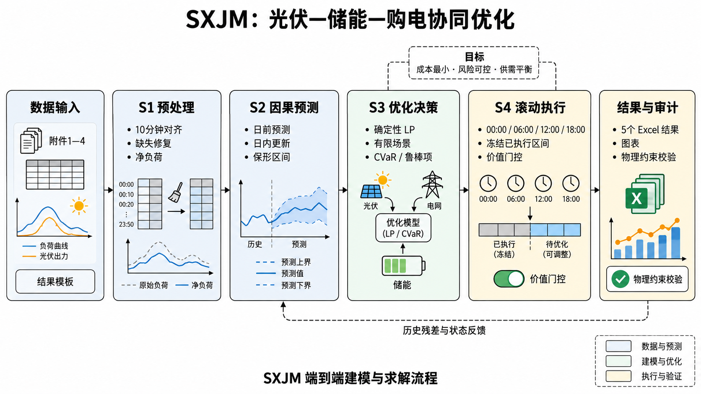
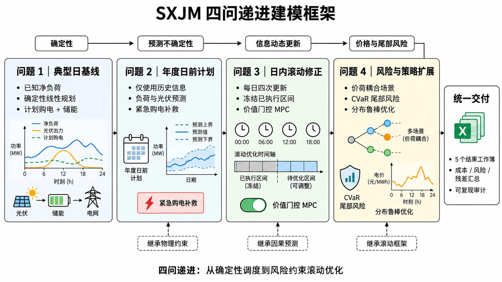
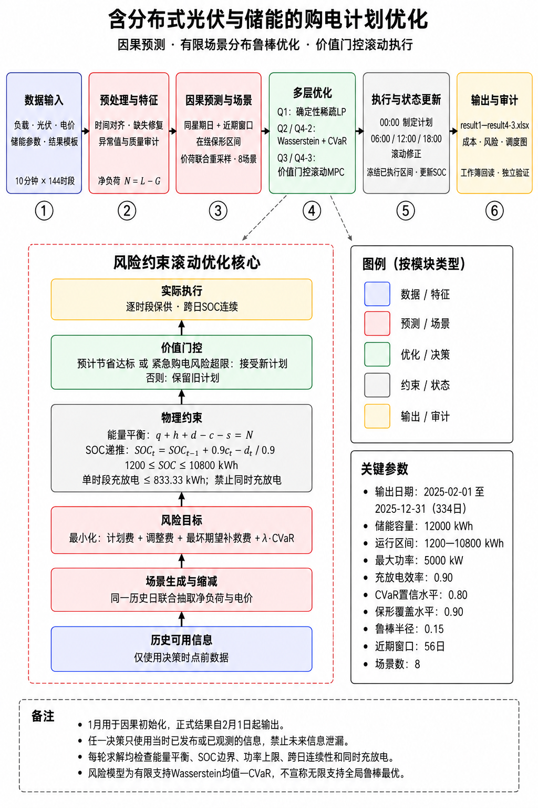
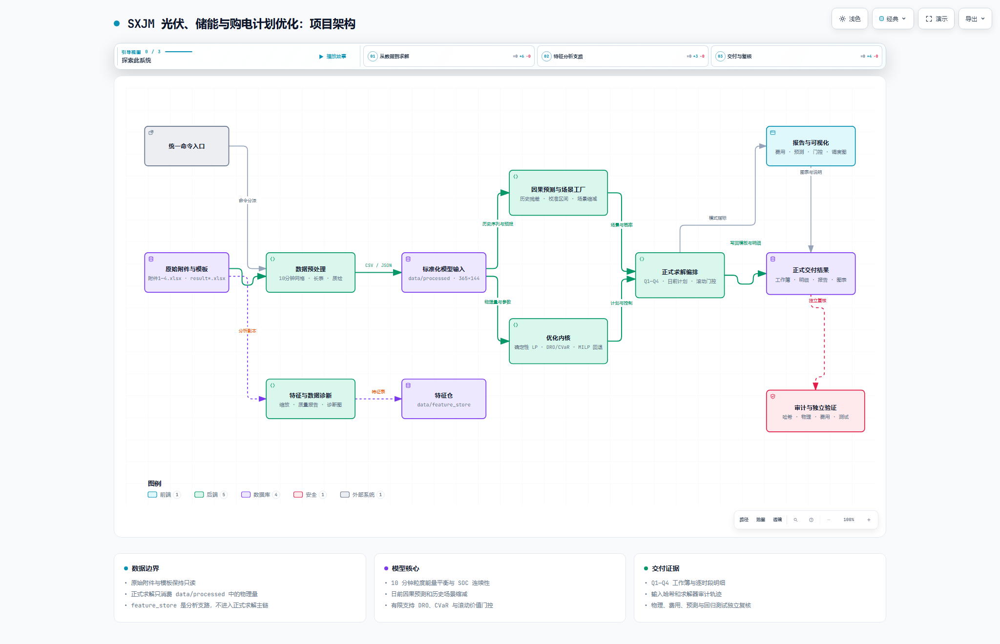

<a name="overview"></a>

[项目首页](../README.md) · [章节目录](../README.md#chapters)

# 总体思路

[模型处理流程](#overview-section-1) · [代码与模型的对应关系](#overview-section-2)

题目数据分为典型日负载与电价、全年负载与光伏实际出力、分时发布的光伏预测、全年波动电价。程序先把它们对齐到 10 分钟时段，再按决策时刻可获得的信息构造预测与历史场景，求解购电和储能动作，最后核对能量平衡、储电量连续性和费用。



四问依次扩展：问题一研究已知条件下的典型日最优计划；问题二处理年度预测误差；问题三利用日内新信息修正计划；问题四检验波动电价下的策略表现。



四问共用能量守恒和储能约束：

```text
计划购电 + 紧急购电 + 放电 - 充电 - 弃光 = 负载 - 光伏
本时段储电量 = 上时段储电量 + 充电效率 × 充电量 - 放电量 ÷ 放电效率
```

储电量限制为 1,200～10,800 千瓦时，初值为 6,000 千瓦时，充放电功率上限为 5,000 千瓦。问题一日末回到初值；问题二至四保持跨日连续，不能每天重置。1 月用于预测校准与储能初始化，年度费用评价区间为 2025 年 2 月 1 日至 12 月 31 日，共 334 天。

<a name="overview-section-1"></a>

## 模型处理流程

下图串联数据检查、输入构造、模型求解与结果检验，可结合后文的统一约束和各问题模型阅读。点击图片可打开详细的交互式求解流程图。

[](../assets/diagrams/sxjm-solver-workflow.html)

[打开交互式求解流程](../assets/diagrams/sxjm-solver-workflow.html)，查看日前决策、日内更新与实际执行之间的衔接。

<a name="overview-section-2"></a>

## 代码与模型的对应关系

项目架构图展示统一入口、数据预处理、场景构造、优化内核、求解编排和结果核验之间的关系。阅读代码时，可先从根目录 `main.py` 进入，再按图定位 `src` 中的具体实现；模块说明见[项目目录与开发说明](09-development.md#project)。

[](../assets/diagrams/sxjm-project-architecture.html)

[打开交互式项目架构图](../assets/diagrams/sxjm-project-architecture.html)。两幅交互图及其定义文件统一保存在 `assets/diagrams`。

---

[返回本章顶部](#overview) · [返回项目首页](../README.md)
