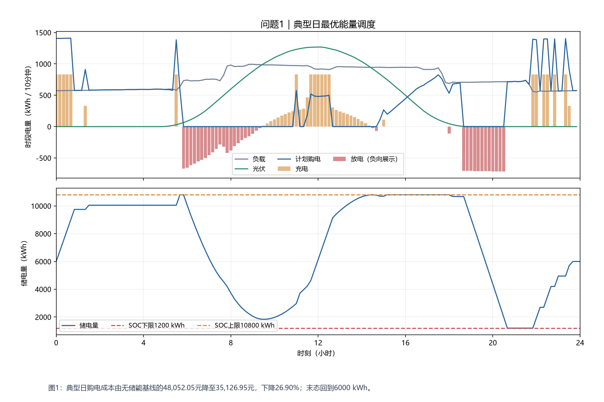

# 问题一：典型日计划

完整模型与本问推导见 [问题求解章节](../../docs/04-question-1.md)。

## 运行方式

在项目根目录执行：

```powershell
uv sync
uv run python main.py q1
```

## 程序输出

下列数值由保存的计算结果生成；机器可读数据见 [运行结果](运行结果.json)。

```text
问题一：典型日计划
计算天数：1
实际总费用：35,126.95 元
无储能费用：48,052.05 元
费用下降：26.90%
```

## 结果文件

- [result1.xlsx](result1.xlsx)：计划购电与储能策略；年度模式同时记录紧急购电，滚动模式另含调整购电。
- [程序输出.txt](程序输出.txt)：本批次费用、电量与调整次数摘要。

## 结果说明与解读

购电和储能按典型日已知输入联合优化，日末储电量回到初值。节约来自光伏消纳与购电时段转移，不能直接外推为全年相同比例的收益。

工作簿保留题目模板结构。年度计划按日期与十分钟时段记录，储能按模板时间块汇总，紧急购电按连续事件记录。

部分日期结果只用于运行检查，不能与完整年度费用直接比较。工作簿合计若为公式，表格软件打开后可重新计算；保留原有数值单元格，不用缺失公式缓存代替真实值。

## 数值与检验说明

工作簿发布前已与求解数值核对，检验信息保存在运行结果中。可在项目根目录执行：

```powershell
uv run python main.py validate --input "result/result1"
```

本命令检查文件哈希、工作簿汇总和可恢复的储能状态；原计算批次的独立统计检验不等于对未来收益的保证。


