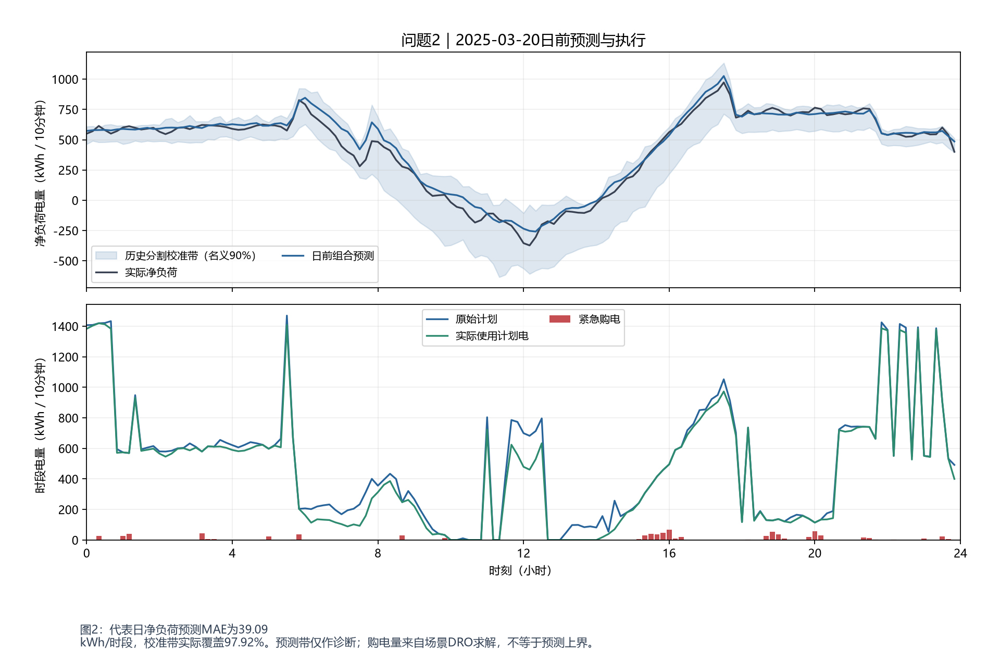

# 问题二：年度日前计划

完整模型与本问推导见 [问题求解章节](../../docs/05-question-2.md)。

## 运行方式

在项目根目录执行：

```powershell
uv sync
uv run python main.py q2
```

## 程序输出

下列数值由保存的计算结果生成；机器可读数据见 [运行结果](运行结果.json)。

```text
问题二：年度日前计划
计算天数：334
实际总费用：16,699,663.60 元
紧急购电量：255,870.79 千瓦时
紧急购电费用：993,419.64 元
接受调整次数：0
```

## 结果文件

- [result2.xlsx](result2.xlsx)：计划购电与储能策略；年度模式同时记录紧急购电，滚动模式另含调整购电。
- [程序输出.txt](程序输出.txt)：本批次费用、电量与调整次数摘要。

## 结果说明与解读

日前计划使用历史场景平衡提前购电与高价补救成本。预测区间只作诊断，计划购电量不等于区间上界。

工作簿保留题目模板结构。年度计划按日期与十分钟时段记录，储能按模板时间块汇总，紧急购电按连续事件记录。

部分日期结果只用于运行检查，不能与完整年度费用直接比较。工作簿合计若为公式，表格软件打开后可重新计算；保留原有数值单元格，不用缺失公式缓存代替真实值。

## 数值与检验说明

| 指标 | 本批次结果 |
|---|---:|
| 原始计划费用（元） | 15,706,243.96 |
| 调整净费用（元） | 0.00 |
| 紧急购电费用（元） | 993,419.64 |
| 充电量（千瓦时） | 5,593,055.69 |
| 放电量（千瓦时） | 4,530,375.11 |

工作簿发布前已与求解数值核对，检验信息保存在运行结果中。可在项目根目录执行：

```powershell
uv run python main.py validate --input "result/result2"
```

本命令检查文件哈希、工作簿汇总和可恢复的储能状态；原计算批次的独立统计检验不等于对未来收益的保证。


